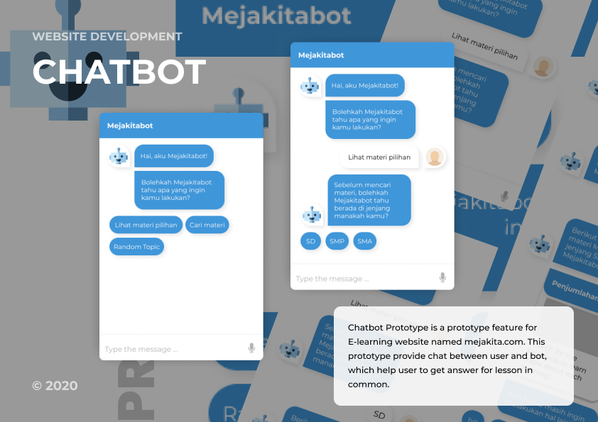

# Chatbot Prototype

---

## Description

Chatbot Prototype is a prototype feature for E-learning website named mejakita.com. This prototype provide chat between user and bot, which help user to get answer for lesson in common.

#### Technologies

- This project was created using react-simple-chatbot library from [this](https://lucasbassetti.com.br/react-simple-chatbot/).
- ReactJs v17.0.1

---

